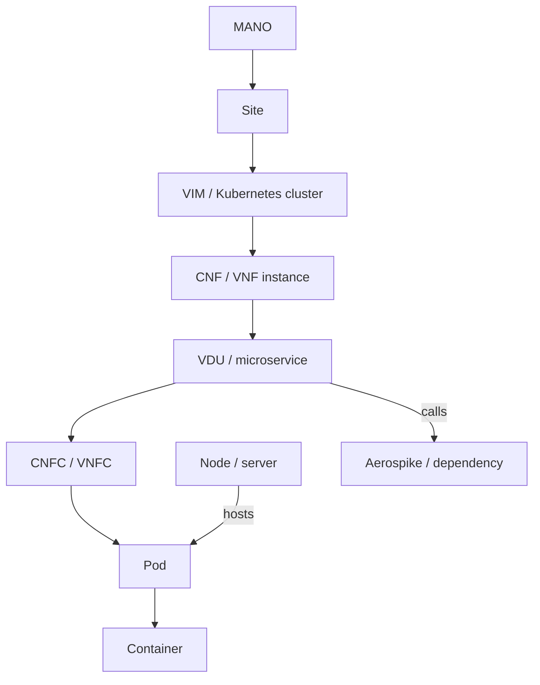

# Mapping MANO/OCS và giới hạn suy luận

Thông tin dùng: mô tả người dùng, nội dung text chat chia sẻ `base_rca`, ba tài liệu trong `RCA/` đã khảo sát ở v1, notebook viễn thông và cấu trúc yêu cầu. Ảnh upload trong shared chat không hiển thị nội dung để kiểm chứng. Tần suất APP 10s/DB 20s/container 40s/server 60s từ text chat là giả định cần đối chiếu export thật, chưa hard-code vào pipeline.

Đây là graph quan hệ, không phải cây trong đó node là con của container. `contains/member_of` mô tả quản lý; `hosts` mô tả placement; `calls/depends_on` mô tả dependency. Topology lưu valid_from/valid_to/available_at/version. Quan hệ calls đảo chiều khi dùng heuristic lan truyền lỗi: downstream có thể là nguyên nhân, upstream là symptom. Không tuyên bố đã học causal graph.

| Tầng | Dữ liệu ưu tiên | Xử lý | Không suy diễn |
|---|---|---|---|
| APP | request/result/error/timeout counter, latency | Counter → rate theo series; gauge latency giữ đơn vị | Không đổi MCR Alibaba thành counter; không gộp mã nghiệp vụ khác nhau |
| DB | Aerospike error, stop_writes, memory, XDR | Gauge/flag/rate, template log, topology dependency | Public DB proxy không chứng minh đúng Aerospike/XDR |
| CONTAINER | CPU, working set/RSS/limit, filesystem | CPU counter → cores; phần trăm chỉ khi biết quota/capacity | CPU core không tự coi là utilization % |
| SERVER | CPU/RAM/disk/filesystem, node info | Entity node + host relations có version | Không gán lỗi node chỉ vì nhiều pod cùng abnormal |

Giữ các label gốc trong canonical `labels`: instance/job/node/namespace/pod/pod_id/pod_type/container/service_type/vim_instance_name/cnf_id/vnf_instance_name/command_name/type/code. UUID hoặc tuple cluster+namespace+pod UID phù hợp identity; pod name tái sử dụng cần version. `pod_type` có thể map VDU nhưng phải kiểm danh mục MANO. Mapping external service→VDU/CNFC là semantic proxy, không tạo CNF ID giả.

Latency histogram chưa tự tính p95: không trung bình bucket/các percentile. Muốn p95 phải có bucket count/rate và le, rồi tính quantile đúng schema. Error ratio phải sum(errors)/sum(requests) theo cùng tập nhãn/cửa sổ, không trung bình tỷ lệ các pod. Các feature này cần bổ sung sau khi xác nhận schema; bản hiện tại từ chối histogram như gauge tùy tiện.

Pipeline public hiện trả score/evidence nghi vấn. Không thực thi scale/restart/heal/rollback. Trước shadow cần incident Gold, nhãn chậm có timestamp, inventory và dependency lịch sử, metric kind/unit, log completeness, SLO đánh giá continuous detection và feedback kỹ sư. Không dùng performance trên CPU stress làm cam kết phân biệt code fault với DB/network trên OCS.
