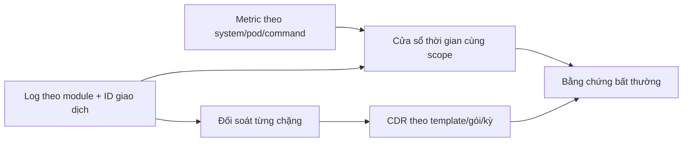

# Liên kết metric – CDR và điều kiện bất thường

## 1. Đã kiểm tra những gì?

- Hai ảnh discovery: **60 tên metric** (APP 13, DB 28, container 8, server 11). Danh sách đầy đủ: [metric_inventory.csv](metric_inventory.csv).
- Excel: **117 sheet**, **109 sheet schema**, **6.215 vị trí trường**, **1.144 tên trường phân biệt nguyên văn**, **254 nhóm tên bị lặp trong cùng sheet**. Tất cả vị trí, tên, template/service ID, kiểu khai báo, delimiter, format: [cdr_field_inventory.csv](cdr_field_inventory.csv).
- 8 sheet còn lại là tổng hợp/streaming/kiểm tra/filter, sheet số liệu phụ hoặc rỗng; không xem chúng là schema CDR. `STATUS`/`OK` trong sheet tổng hợp là trạng thái vận hành/kiểm tra, không phải nhãn incident.
- Word mô tả 20 loại CDR gia hạn, 4 luồng nghiệp vụ và mẫu log từng chặng. Đây là cơ sở lập giả thuyết/rule; chưa có chuỗi metric/log đồng thời để tính hệ số tương quan thực tế.

Tên metric được đọc từ ảnh, chưa đối chiếu API discovery hoặc `HELP/TYPE` trực tiếp. Cột type trong inventory là ứng viên cần xác nhận, không phải metadata exporter đã kiểm chứng.

## 2. Điều cần sửa trong cách hiểu request/response

**Request/response là số sự kiện, không phải số byte upload/download.** CDR có `UP_DATA`, `DOWN_DATA`, `BYTES`; upload và download không bắt buộc bằng nhau.

Nếu hợp đồng của API là một request nhận đúng một response cuối cùng, sau khi xử lý hết và cùng scope thì số lượng phải cân bằng. Trong một cửa sổ ngắn, còn request đang xử lý nên chênh lệch chưa đủ để kết luận lỗi.

Đặt `Q=increase(request_counter[W])`, `S=increase(response_counter[W])` trên cùng instance/entity/command/cohort:

- `gap = Q - S`: dương có thể đang tồn đọng/thiếu response; âm có thể trả backlog hoặc đếm trùng/retry.
- `gap_ratio = abs(Q-S)/Q`, chỉ khi Q>0. Q=0/S>0 cần phân loại riêng, không chia 0 hoặc bỏ qua.
- Nếu xác nhận semantics: `Q-S = thay đổi số đang xử lý + số kết thúc không phát response`. Không cộng drop/timeout vào công thức khi chưa biết chúng có nằm trong response hay không.
- Correlation cao vẫn có thể sai: response luôn bằng 90% request sẽ tương quan gần 1 nhưng thiếu 10%. Vì vậy cần cả kiểm tra cân bằng và correlation.
- Latency cao có thể đi cùng `process_time` cao nếu metric đo cùng đường xử lý. Nếu chờ Kafka/network nằm ngoài timer thì process_time có thể thấp dù end-to-end chậm.

Counter phải chuyển rate/increase và xử lý reset trước khi so sánh. Histogram phải giữ bucket và tính quantile đúng; không lấy trung bình các cận `le`. Tham chiếu: [Prometheus functions](https://prometheus.io/docs/prometheus/latest/querying/functions/).

## 3. Liên kết các trường CDR

| Nhóm | Tên quan sát được trong nguồn | Cách dùng và giới hạn |
|---|---|---|
| Schema/luồng | `cdr_template_id`, `template_code`, `cdr_service_id`, `prop_name`, `cdr_prop_id`, `delimiter`, `format` | Chọn parser theo phiên bản/template/service ID; schema mới không được âm thầm bỏ cột |
| Giao dịch | `CALL_ID`, `CHARGING_CALL_ID`, `SESSION_ID`; log Word có `sessionId`, `PARENT_REQUEST_ID` | Ứng viên nối chặng, phải xác nhận chúng có giữ nguyên/quan hệ cha-con; không tự coi các ID khác tên là bằng nhau |
| Thuê bao/tài khoản | `MSISDN`, `ISDN`, `CALLING_NBR`, `SUB_ID`, `CONTRACT_ID`, `ACCT_ID`, `PAID_SUB_ID`, `PAID_CONTRACT_ID` | Chuẩn hóa có mapping; người dùng/người trả tiền có thể khác nhau; giữ ID dạng chuỗi |
| Gói và kỳ | `PRICE_PLAN_ID`, `SUB_PRICE_PLAN_ID`, `PRODUCT_CODE`, `OFFER_NAME`, `BILL_CYCLE`, `CYCLE_BEGIN_DATE`, `CYCLE_END_DATE`, `NUMBER_CYCLE` | Đối soát theo gói/kỳ/nghiệp vụ; không dedup chỉ theo thuê bao |
| Thời gian | `RECURRING_TIME`, `CREATE_DATE`, `ACTION_DATE`, `EVENT_BEGIN_TIME`, `EVENT_END_TIME`, `STA_DATETIME`, `END_DATETIME`, `UNTIL_DATE`, `ACM_DATE` | Phân biệt event time, thời gian tạo, kỳ hiệu lực, thời gian thu thập; không mặc định END-STA là request latency |
| Kết quả | `RESULT_CODE`, `RESULT_REASON`, `TYPE`, `ORDER_STATUS`, `SEND_RESULT`, `CDR_ERROR_NO`; Word có `Rating`, `AbmRet`, `RECUR_SUCCESS`, `REJECT`, `RetryQuery`, `RetryTimeout` | Từ điển mã riêng từng component/template. Rating 2001 và AbmRet 0 xuất hiện ở mẫu thành công; không áp quy tắc này cho mọi trường/mọi service |
| Giá trị cước | `CHARGE1`, `CHARGETOTAL`, `CHARGE`, `RESOURCE_CHARGE1`, `DEBIT_AMOUNT`, `UN_DEBIT_AMOUNT`, `DISCOUNT`, `TOTAL_TAX`, `CURRENCY`, `REFUND_INDICATOR` | Cần đơn vị, tỷ lệ scale, dấu, loại tài khoản, thuế, miễn/giảm và refund; chưa đủ để kết luận thất thoát |
| Mã số/placeholder | `9001`, `9101`, `9201`, `903002`, `UNUSED_PROP`… | Là tên trường/slot của template, không suy nghĩa tài chính từ số; phải có dictionary |
| Khối lượng dịch vụ | `UP_DATA`, `DOWN_DATA`, `BYTES`, `DURATION`, `ACTUAL_USAGE`, `RATE_USAGE` | Dùng đúng loại dịch vụ, đơn vị; không ép upload=download hoặc duration=latency |

**Phát hiện cụ thể cần xử lý trước parser:**

1. `FTTH_RECURRING_DAILY!D11` và `D23` đều là `RESOURCE_CHARGE1`. `HP_RECURRING_CDR_PUSH` lặp `CALL_ID`, `BILL_CYCLE`, `RESULT_CODE`, `ACCT_ID`… Dùng `(template_version, field_position, original_name)`; chuyển thành dict tên→giá trị sẽ mất dữ liệu.
2. Có biến thể `TELECOM_SERVICE_ID`, `TelecomServiceID`, `TELECOMSERVICE_ID`; chỉ tạo alias khi xác nhận cùng ngữ nghĩa. `SERVICE_ID` trong payload không tự động bằng `cdr_service_id` của luồng ghi file.
3. `Recurring_fail_push` chỉ khai báo `MSISDN, PRICE_PLAN_ID, OFFER_NAME, TYPE`, không có timestamp riêng. Cần timestamp log/file và đánh dấu nguồn thời gian; không bịa timestamp sự kiện.
4. Sheet `CDR_streaming` ghi nhận drift như 147→150 trường và thêm `IsRecurringVtpay`. Cần schema version và quarantine sai số cột, không tự cắt đuôi.
5. Word §1.3.4 có tiêu đề “không qua recurring” nhưng đoạn flow lại mô tả `RecurringMsg`/`recurring-online`; cần owner xác nhận nhánh thực thi. Không dùng đoạn này làm topology khẳng định.
6. Word ghi mẫu `FTTH_RECURRING_SUBPROD` còn chờ bổ sung: Excel có schema không có nghĩa log thực tế đã được đối chiếu đầy đủ.

## 4. Bảng tình huống bất thường

Mọi điều kiện dưới đây cần cùng scope, dữ liệu đủ, baseline cùng giờ/ngày/chu kỳ và ngưỡng owner phê duyệt. Đây là rule ứng viên, không phải kết luận đang có sự cố.

| ID | Trường liên quan | Dấu hiệu kết hợp | Cần kiểm tra trước khi kết luận |
|---|---|---|---|
| R01 | request_counter ↔ response_counter | Gap vượt dung sai và tồn tại quá thời gian hoàn tất cho phép | In-flight, retry, response cuối/response trung gian, reset, mất scrape |
| R02 | process_time/process_time_ms ↔ request/response | Latency tăng, throughput response không theo kịp request | Đơn vị, timer scope, thay đổi mix command; chưa có metric p95 thì không gọi là p95 giao dịch |
| R03 | request_timeout_counter, all_msg_counter_timeout ↔ process_time | Timeout rate/ratio tăng cùng latency | Cùng denominator/cohort; timeout có thể sau response hoặc do client |
| R04 | request_drop_counter ↔ request_counter | Drop ratio tăng khi tải tăng | Định nghĩa drop có bao gồm throttle chủ động không |
| R05 | result_code_counter, desc_code_counter, app_exception_counter | Error kỹ thuật/exception tăng theo command | Business reject không mặc định là lỗi hệ thống; phân loại type/code riêng |
| R06 | external_counter, counter_mml, all_msg_counter_eventtype | Đầu vào còn nhưng bước xử lý kế tiếp giảm/dừng | Không so tổng khác module; MML/event có fan-out, filter hoặc sampling |
| R07 | aerospike_namespace_client_{read,write,delete}_{success,error} | Error/(success+error) tăng theo thao tác/DB namespace | Thao tác cùng nguồn đếm; retry tăng số attempt, không đồng nhất giao dịch |
| R08 | aerospike_latencies_{read,write}_ms_bucket ↔ process_time_ms | DB p95 tăng trước/cùng APP latency | Giữ le, đúng DB→APP mapping; lag thống kê chưa chứng minh nhân quả |
| R09 | memory_free_pct, device_available_pct, hwm_breached, stop_writes, clock_skew_stop_writes, dead_partitions, cluster_size | Tài nguyên giảm kèm cờ dừng ghi/partition lỗi hoặc cluster giảm ngoài kế hoạch | Phiên bản/config Aerospike, thay đổi cluster có chủ đích, ngưỡng chính thức |
| R10 | xdr_lag, xdr_latency_ms, xdr_lap_us, xdr_retry_*, xdr_recoveries(_pending), xdr_success | Lag/backlog/retry tăng, tốc độ success giảm | Cùng đích XDR; đổi µs/ms nếu xác nhận; network chậm mới là giả thuyết |
| R11 | container_cpu_usage_seconds_total, container_spec_cpu_quota ↔ process_time | CPU core usage tăng cùng latency và timeout | Quota cần period để ra số core cho phép; ảnh thiếu CPU period/throttling nên chưa tính saturation chắc chắn |
| R12 | container_memory_working_set_bytes, container_memory_rss, container_spec_memory_limit_bytes | Working set/limit cao kéo dài cùng exception/restart evidence | Limit hợp lệ; RSS và working set không cộng trực tiếp; thiếu restart/OOM metric nên chưa kết luận OOM |
| R13 | node_memory_MemAvailable_bytes/MemTotal_bytes; node_filesystem_free_bytes/size_bytes | Available/free ratio giảm cùng lỗi ghi hoặc chậm | Cùng node/device/mountpoint; free không bằng available của user thường |
| R14 | node_disk_{read,write}_time_seconds_total, node_disk_{reads,writes}_completed_total, byte counters, container_fs_*_bytes_total | Thời gian IO/operation tăng cùng DB/app latency | rate(time)/rate(ops), denominator>0; không suy disk utilization từ các metric này |
| R15 | RecurringMsg → transactionSuccess/Fail → TriggerMsg → CdrEvent → CDR | Một chặng có đầu vào hợp lệ nhưng chặng sau thiếu quá SLA | Filter, retry, skip hợp lệ, batch flush; cần ID và hệ số fan-out |
| R16 | RECUR_SUCCESS, Rating, AbmRet ↔ CDR service 85 hoặc template đích | Giao dịch thành công đủ điều kiện nhưng thiếu CDR sau thời gian chờ | CDR có ở file/Billing khác/site chuyển đổi không; thiếu CDR chưa đồng nghĩa chưa trừ tiền |
| R17 | Recurring_fail_push.TYPE ↔ response_counter labels rec_error_* | Fail tăng bất thường theo gói/kỳ kèm timeout/exception | Hết tiền/chủ động dừng gia hạn là business outcome; TYPE chưa có dictionary thì giữ unknown |
| R18 | CALL_ID/CHARGING_CALL_ID + gói/kỳ/service/site | Cùng business event sinh nhiều CDR hoặc ghi tiền lặp | Không dedup mù theo thuê bao; tách retransmit, correction, refund và split record |
| R19 | CHARGE1/RESOURCE_CHARGE1 ↔ balance/ABM transaction/Billing | Số tiền giữa các sổ không khớp trên cùng giao dịch | Scale, currency, thuế/discount, partial charge, miễn phí; cần ledger bổ sung |
| R20 | RECURRING_TIME/CREATE_DATE + lịch batch ↔ count CDR | Thiếu/lệch ngày hoặc CDR ghi tới muộn | Đầu tháng có spike hợp lệ, timezone, chuyển site, file flush, lịch filter |

`kube_pod_info`, `node_uname_info` phục vụ nối topology, không đem giá trị hằng 1 vào correlation. Ảnh hiện tại không có node_cpu_seconds_total, network RTT, Kafka lag, CPU throttling hay restart counter; chúng là dữ liệu cần bổ sung, không phải tín hiệu đã sẵn có.

## 5. Cách nối metric và CDR

- Metric↔metric: dùng system/site/VIM/CNF/entity/command và các dimension nghiệp vụ tương ứng; không trộn command `all` với command con.
- Log↔CDR: ưu tiên ID giao dịch đã xác minh; nếu chỉ còn thuê bao+gói+kỳ+time thì là candidate match, ghi confidence/ambiguity, không coi là join chắc chắn.
- Metric↔CDR: thường là join aggregate theo time+component+business cohort, không phải join metric series với MSISDN. Cần mapping `cdr_service_id → module/CNF/VDU → metric labels`, có hiệu lực theo thời điểm.
- Không mặc định `instance` exporter, `service_type` metric và `SERVICE_TYPE` CDR có cùng mã. Namespace DB và namespace Kubernetes cũng khác nhau.

## 6. Visualize và kiểm tra tương quan khi có dữ liệu

1. **Data quality trước:** missing, reset counter, timestamp lệch, duplicate, schema version, độ phủ từng cohort. Giữ NA; không fill 0 cho mất telemetry.
2. **Timeline 3 panel:** request/response rate; gap/gap_ratio; process_time và timeout ratio. Vẽ mốc incident/config-change và phần reference.
3. **Scatter:** request↔response với đường y=x; gap↔process_time; DB latency↔APP latency. Tách màu reference/current và command.
4. **Heatmap Pearson và Spearman:** tính trên rate/gauge đã căn thời gian; xuất số cặp hợp lệ n. Hằng số trả NA. Tính reference/current riêng, thêm ma trận thay đổi correlation.
5. **Lag plot:** corr(X(t), Y(t+k)), k>=0 biểu thị Y đi sau X. Chỉ ghép timestamp có thật, không nối qua missing; giới hạn lag/min_pairs theo config. Đây là lag của chuỗi aggregate, không phải latency giao dịch.
6. **CDR:** funnel số giao dịch hợp lệ từng chặng; missing/duplicate theo template; arrival delay; count/charge theo gói/kỳ/site. Bản ghi raw và reject nghiệp vụ cần tách khỏi lỗi kỹ thuật.
7. **Quyết định:** yêu cầu vượt ngưỡng trong một khoảng liên tục, tối thiểu traffic và nhiều bằng chứng. Thử ngưỡng trên reference/validation; không đặt SLA “cực thấp” bằng một số tùy ý.

Với scrape 10 giây và feature window 60 giây hiện tại, không thể đo độ trễ vài ms của từng giao dịch bằng cross-correlation. Cần timestamp request/response cùng transaction ID hoặc histogram/trace đúng semantics. Chưa có chuỗi đồng bộ nên báo cáo này không tạo hệ số correlation, đồ thị production hoặc nhãn lỗi giả.

Các key có ID trong mẫu log Word được lưu riêng tại [word_log_fields.csv](word_log_fields.csv), phân biệt key khai báo với token trích từ log. Chỉ liệt kê tên/ID, không đưa thông tin thuê bao mẫu vào báo cáo.
